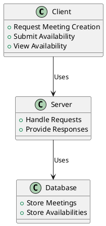
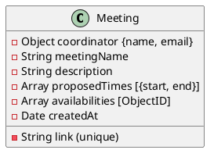
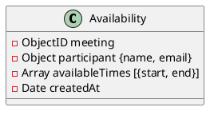
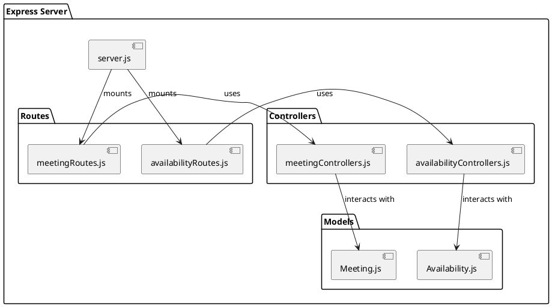

# SET-A-Meet ajsibley Backend Service Documentation

## Overview

This document provides an overview of the backend service for a meeting coordination application. The service facilitates the creation of meetings and the collection of participant availability without requiring user accounts.

## Architecture

### High-Level Architecture

## Database Schema

Meeting Schema

Availability Schema

## Server Structure

# API Endpoints

## Meeting Endpoints

- **`POST /api/meetings/create`**
        Creates a new meeting.
- **`GET /api/meetings/:link`**
        Retrieves a meeting by its unique link.

## Availability Endpoints

- **`POST /api/availabilities/:meetingId/availability`**
        Submits availability for a specific meeting.

# Functionality
## Meeting Creation

The coordinator can create a meeting by sending a POST request to `/api/meetings/create`. This endpoint will generate a unique meeting with a link that can be shared with participants.
## Submitting Availability

Participants follow the unique link to a form where they submit their availability. This creates an Availability entry in the database associated with the Meeting.
## Viewing Availability

The coordinator can view all submitted availabilities by accessing the meeting via its unique link, allowing them to coordinate the meeting time effectively.
